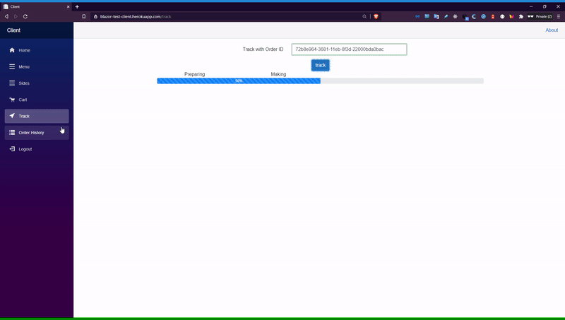

# Project
Ordering pizza and side dishes at a fake pizza shop 

# Motivation
I have studied backend, frontend, and sql so far, but I have not had any experience in releasing a product by integrating these. Through this project, although incomplete, I wanted to gain experience in making products.  
And for this project, I used techs I haven't used before. I learned a lot about Docker, Blazor,Bootstrap, and Postgresql from this project.

# GIF




# Tech/framework used
- [ASP .NET Core 5.0 Api](https://docs.microsoft.com/en-us/aspnet/core/web-api/?view=aspnetcore-5.0)
- [ASP .NET Core 5.0 Blazor(server)](https://docs.microsoft.com/en-us/aspnet/core/blazor/?view=aspnetcore-5.0)
- [Identity Server 4](https://identityserver4.readthedocs.io/en/latest/)
- [Entity Framework Core](https://docs.microsoft.com/en-us/ef/core/)
- [Postgres 12.5](https://www.postgresql.org/docs/12/index.html)
- [Bootstrap 4](https://getbootstrap.com/)
- [Docker](https://docs.docker.com/get-started/overview/)
### Hosting service
- [Heroku](https://www.heroku.com/)


# Features

API
- Retrive Pizza list
- Retrive Side dishes list
- Create order
- Look up order history
- Track order

Client
- Display Pizza info
- Display Side dish info
- Add items to cart
- Calculate tax and amount paid
- Checkout
- Login


# Api Reference
## Get methods
### **api/pizza/type**
- get pizza type
>example
>/api/pizza/type

### **api/pizza/size**
- get pizza size
>example
>/api/pizza/size

### **api/pizaz/topping**
- get pizza toppings
>example
>/api/pizza/topping

### **api/pizza/sides**
- get side dishes
>example
>/api/pizza/sides

### **api/Pizza/Customers/{id}/Orders**
- get order history by customer id  
`parameter: Guid`
>example
>/api/pizza/Customers/7d9ecead-eca1-48b2-8366-784fb1c17c16/Orders

### **api/Pizza/Orders/{orderId}**
- get order detail by orderId  
`parameter: Guid`
>example
>/api/Pizza/Orders/dc6f9ec8-366f-11eb-8dcc-22000bda0bac


## Post method
### **api/Pizza**
- create an order
>example
>/api/Pizza

>body
```
{
    "Customer":{
        "CustomerId":"7d9ecead-eca1-48b2-8366-784fb1c17c16",
        "FirstName":"Bob",
        "LastName":"Smith",
        "Email":"BobSmith@email.com",
        "PhoneNumber":"519-666-7777"
    },
    "Pizzas":[
        {
            "Qty":2,
            "TypeId":1,
            "SizeId":1,
            "Toppings":[1,2,3]

        }
    ],
    "Sides":[
        {
            "Qty":2,
            "SideId":1

        }
    ]
}
```
